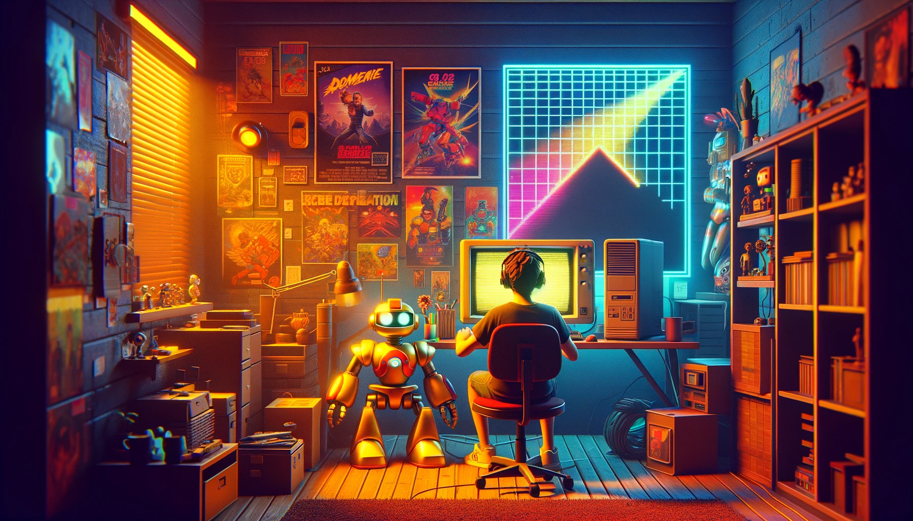

</img>

 

**** 
 
 

# About Me

Hello, I'm Lâm, a passionate software developer living in Vietnam. I'm proud to call this country my home and find inspiration in its rich culture and vibrant energy.

I graduated from FPT School, a prestigious university in Vietnam, with a degree in computer science. My journey into the world of software development began about 3.5 years ago, and since then, I've been eager to learn and grow in this ever-evolving field.

My coding journey started with an interest in various programming languages. Like Javascript, Typescript, PHP, HTML, CSS,...

I'm constantly seeking new challenges and opportunities to improve my skills and contribute to the thriving tech community in Vietnam. When I'm not coding, I enjoy exploring the country's beautiful landscapes, trying new foods, and connecting with fellow developers.

## Languages and Tools

  
  
  
  
  
  

## Github Stats

<table align="center" width="100%" height="100%" border=0>
    <tr>
       <td></td>   
       <td></td>
    </tr>
 </table>

 <table align="center" width="100%" height="100%" >
    <tr>
        <td></td>
        <td>
        <td></td>
        <td></td>
    </tr>
 </table>

## Blogs

## Other Things

     
    
            
        

## Random Joke

<!-- HTML -->

<!--
**lamzaaa/lamzaaa** is a ✨ _special_ ✨ repository because its `README.md` (this file) appears on your GitHub profile.

Here are some ideas to get you started:

- 🔭 I’m currently working on ...
- 🌱 I’m currently learning ...
- 👯 I’m looking to collaborate on ...
- 🤔 I’m looking for help with ...
- 💬 Ask me about ...
- 📫 How to reach me: ...
- 😄 Pronouns: ...
- ⚡ Fun fact: ...
-->
